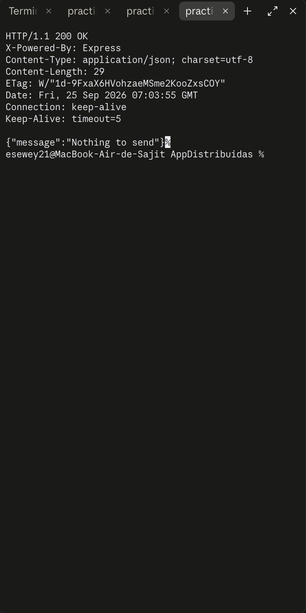
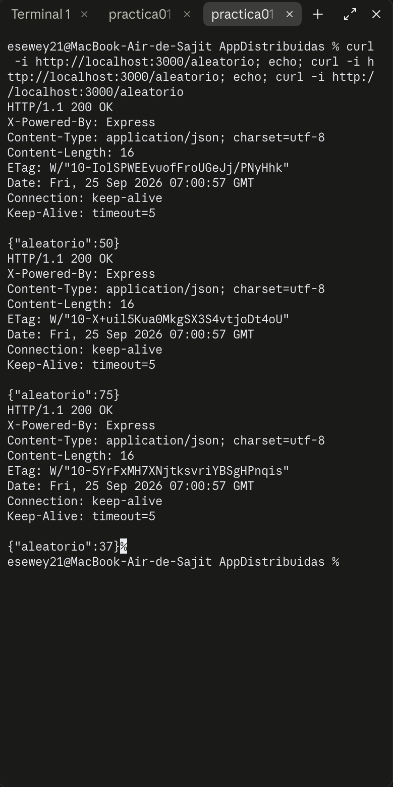

# Práctica 1 — Primer servidor REST (`practica01-aleatorio`)

## Objetivo

Crear el primer servidor web con **Express** y entender el ciclo básico de una API REST: el servidor escucha en un puerto, define rutas (URL + método HTTP) y responde en formato JSON.

## Tecnologías

- Node.js (CommonJS)
- Express 5

## Instalación y ejecución

```bash
npm install
npm start
```

El servidor queda escuchando en `http://localhost:3000`.

## Endpoints

| Método | Ruta | Request | Response |
|--------|------|---------|----------|
| GET | `/` | — | `200 { "message": "Nothing to send" }` |
| GET | `/aleatorio` | — | `200 { "aleatorio": n }`, con `n` un entero aleatorio entre 1 y 100 |

## Cómo funciona el código

`index.js` crea una app de Express y registra dos middlewares globales, `express.json()` y `express.urlencoded({ extended: true })`, que permiten leer bodies en JSON o de formulario en futuras rutas (en esta práctica no se usan porque no hay `POST`, pero es el patrón base que se repite en el resto de las prácticas).

La ruta `GET /` solo confirma que el servidor está vivo, respondiendo un mensaje fijo.

La ruta `GET /aleatorio` genera un entero aleatorio del 1 al 100 con:

```js
const aleatorio = Math.floor(Math.random() * 100) + 1;
```

`Math.random()` devuelve un decimal entre 0 (inclusive) y 1 (exclusivo); al multiplicarlo por 100 y truncarlo con `Math.floor` se obtiene un entero de 0 a 99, y sumando 1 el rango queda de 1 a 100. Como `Math.random()` da un valor distinto en cada llamada, cada petición a esta ruta devuelve un número diferente.

## Pruebas realizadas

Se levantó el servidor con `node index.js` y se probaron ambas rutas con `curl -i` contra el servidor real.

**`GET /`:**



**`GET /aleatorio` (tres llamadas seguidas, mostrando que el número cambia cada vez — 50, 75 y 37):**


