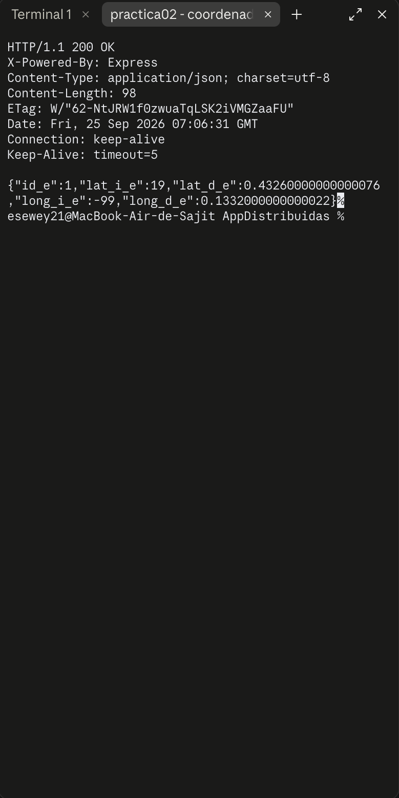
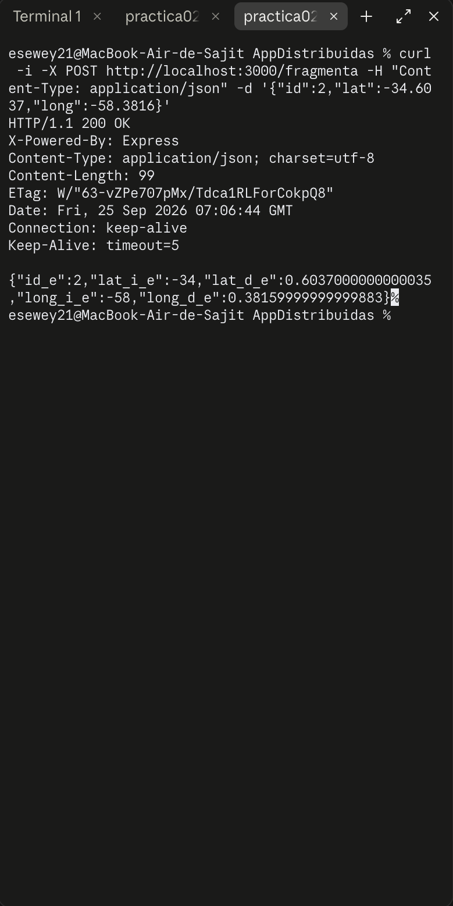

# Práctica 2 — Fragmentar coordenadas (`practica02-fragmenta`)

## Objetivo

Recibir datos por el body de una petición `POST` y procesarlos: separar una coordenada geográfica (`lat`, `long`) en su parte entera y su parte decimal.

## Tecnologías

- Node.js (CommonJS)
- Express 5

## Instalación y ejecución

```bash
npm install
npm start
```

El servidor queda escuchando en `http://localhost:3000`.

## Endpoints

| Método | Ruta | Request (body) | Response |
|--------|------|-----------------|----------|
| POST | `/fragmenta` | `{ "id": 1, "lat": "19.4326", "long": "-99.1332" }` | `200 { "id_e": 1, "lat_i_e": 19, "lat_d_e": 0.4326, "long_i_e": -99, "long_d_e": 0.1332 }` |

`lat` y `long` aceptan tanto texto (`"19.4326"`) como número (`19.4326`).

## Cómo funciona el código

La ruta lee `id`, `lat` y `long` del body (gracias al middleware `express.json()`). Como `lat`/`long` pueden llegar como texto, primero se normalizan con `parseFloat`, que funciona igual reciba una cadena o un número.

Con el valor numérico ya listo, se separa en dos partes:

```js
const entero = Math.trunc(valor);           // parte entera, sin redondear
const decimal = Math.abs(valor - entero);   // parte decimal, siempre positiva
```

- `Math.trunc` corta el número hacia cero (no redondea): `Math.trunc(-99.1332)` da `-99`, no `-100`.
- La resta `valor - entero` da el residuo decimal, que conserva el signo del número original si es negativo (ej. `-99.1332 - (-99) = -0.1332`). Por eso se envuelve en `Math.abs`, para que la parte decimal siempre se reporte como un valor positivo.

La respuesta agrupa ambos resultados (`lat` y `long`) junto con el `id` recibido.

## Pruebas realizadas

Servidor levantado con `node index.js`, probado con `curl -i -X POST` contra el servidor real.

**Coordenada con signos mixtos, enviada como texto** (`lat: "19.4326"`, `long: "-99.1332"`):



**Coordenada totalmente negativa, enviada como número** (`lat: -34.6037`, `long: -58.3816`):



En ambos casos la parte entera conserva el signo original y la parte decimal se reporta siempre positiva.
