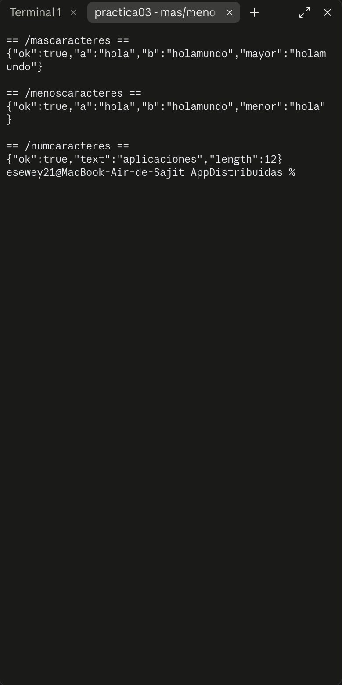
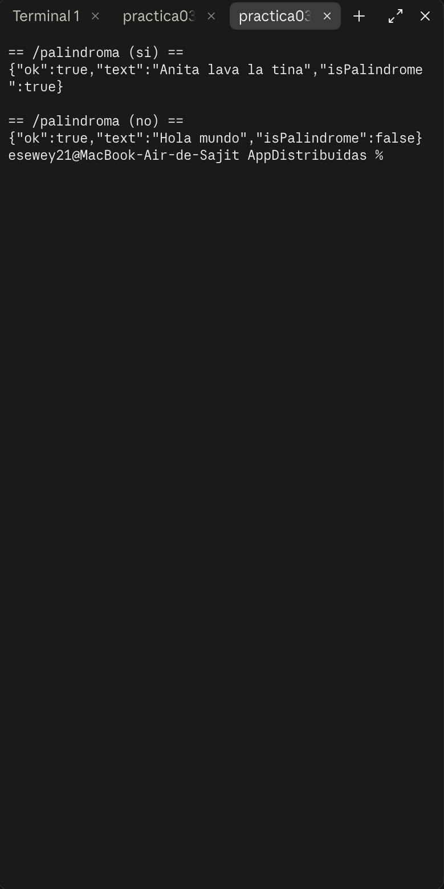
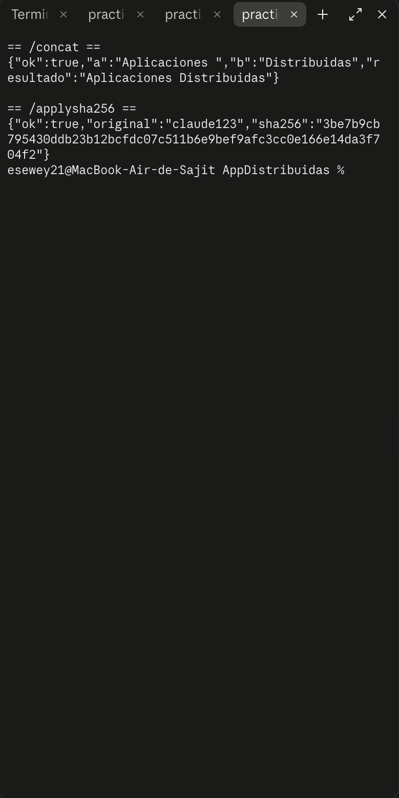
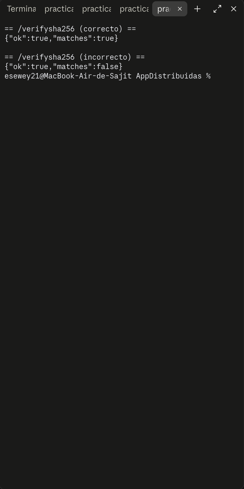
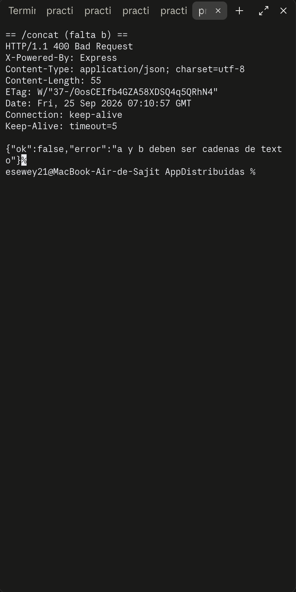

# Práctica 3 — Cadenas y SHA-256 (`practica03-cadenas-sha256`)

## Objetivo

Crear 7 servicios `POST` que manipulan cadenas de texto, todos con el mismo contrato de validación: si el body es correcto, responden `200 { ok: true, ... }`; si falta un parámetro o tiene el tipo equivocado, responden `400 { ok: false, error }`.

## Tecnologías

- Node.js (CommonJS)
- Express 5
- Módulo nativo `crypto` (hashing SHA-256)

## Instalación y ejecución

```bash
npm install
npm start
```

El servidor queda escuchando en `http://localhost:3000`.

## Endpoints

| Ruta | Body | Response 200 | Response 400 |
|------|------|---------------|---------------|
| `POST /mascaracteres` | `{ a, b }` | `{ ok:true, a, b, mayor }` (la cadena más larga) | `{ ok:false, error }` |
| `POST /menoscaracteres` | `{ a, b }` | `{ ok:true, a, b, menor }` (la cadena más corta) | `{ ok:false, error }` |
| `POST /numcaracteres` | `{ text }` | `{ ok:true, text, length }` | `{ ok:false, error }` |
| `POST /palindroma` | `{ text }` | `{ ok:true, text, isPalindrome }` | `{ ok:false, error }` |
| `POST /concat` | `{ a, b }` | `{ ok:true, a, b, resultado }` (`a + b`) | `{ ok:false, error }` |
| `POST /applysha256` | `{ text }` | `{ ok:true, original, sha256 }` | `{ ok:false, error }` |
| `POST /verifysha256` | `{ plain, hash }` | `{ ok:true, matches }` | `{ ok:false, error }` |

Todas las rutas validan que los campos esperados existan y sean cadenas de texto; si no, responden `400`.

## Cómo funciona el código

**Validación común:** cada ruta revisa con `typeof valor === "string"` que los campos requeridos sean texto; si alguno falta o llega con otro tipo, se corta con `res.status(400).json({ ok:false, error })` antes de procesar nada.

**`/mascaracteres` y `/menoscaracteres`:** comparan `a.length` contra `b.length` y devuelven la cadena correspondiente.

**`/numcaracteres`:** devuelve `text.length` directamente.

**`/palindroma`:** normaliza el texto a minúsculas y le quita los espacios (`text.toLowerCase().replace(/\s+/g, "")`), y compara ese resultado contra su propio reverso (`split("").reverse().join("")`). Así, "Anita lava la tina" y "anitalavalatina" se tratan igual.

**`/concat`:** concatena `a + b` tal cual.

**`/applysha256`:** usa el módulo nativo `crypto` para calcular el hash SHA-256 de un texto en hexadecimal:

```js
crypto.createHash("sha256").update(text).digest("hex");
```

SHA-256 es una función de **un solo sentido**: del hash no se puede recuperar el texto original, solo se puede volver a calcular el hash de un texto y comparar.

**`/verifysha256`:** recibe un texto plano y un hash, calcula el SHA-256 del texto y compara si coincide con el hash recibido (`matches: true/false`). Este es el mecanismo real detrás de la verificación de contraseñas: nunca se guarda ni se compara la contraseña en texto plano, solo su hash.

## Pruebas realizadas

Servidor levantado con `node index.js`, todas las rutas probadas con `curl` contra el servidor real.

**`/mascaracteres`, `/menoscaracteres`, `/numcaracteres`:**



**`/palindroma`** — un caso que sí es palíndromo ("Anita lava la tina") y uno que no ("Hola mundo"):



**`/concat` y `/applysha256`:**



**`/verifysha256`** — un hash correcto y uno incorrecto:



**Caso de error 400** — `POST /concat` sin el campo `b`:


