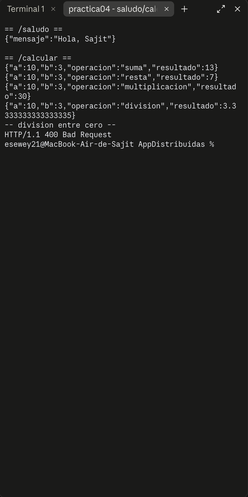
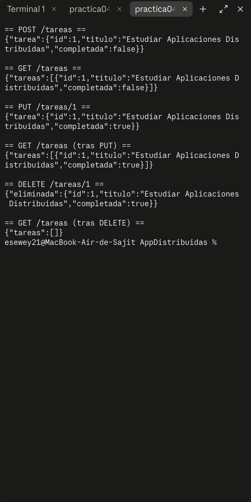
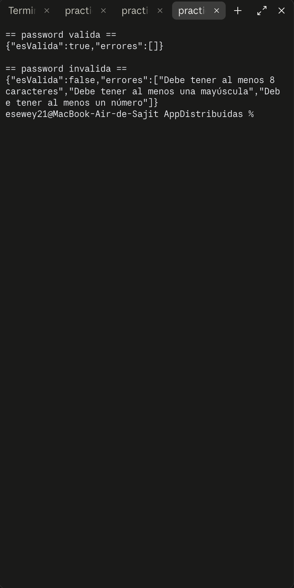
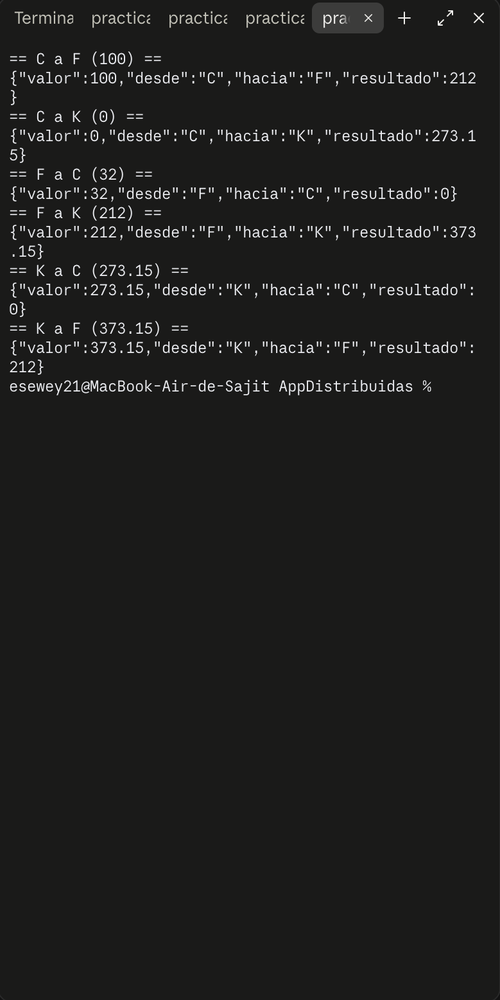
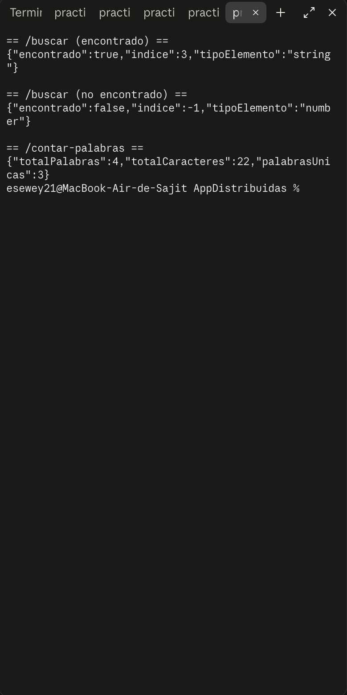

# Práctica 4 — Siete ejercicios REST (`practica04-ejercicios-rest`)

## Objetivo

Practicar siete endpoints REST independientes con un mismo patrón de respuesta: una función común `respuesta(res, estado, data)` que responde `200` si `estado` es `true` y `400` si es `false`.

## Tecnologías

- Node.js (CommonJS)
- Express 5

## Instalación y ejecución

```bash
npm install
npm start
```

El servidor queda escuchando en `http://localhost:3000`.

## Endpoints

| # | Ruta | Body | Response |
|---|------|------|----------|
| 1 | `POST /saludo` | `{ nombre }` | `{ mensaje: "Hola, {nombre}" }` |
| 2 | `POST /calcular` | `{ a, b, operacion }` (`suma`\|`resta`\|`multiplicacion`\|`division`) | `{ a, b, operacion, resultado }` |
| 3 | `POST /tareas` | `{ id, titulo, completada }` | `{ tarea }` |
| 3 | `GET /tareas` | — | `{ tareas: [...] }` |
| 3 | `PUT /tareas/:id` | `{ titulo?, completada? }` | `{ tarea }` |
| 3 | `DELETE /tareas/:id` | — | `{ eliminada }` |
| 4 | `POST /validar-password` | `{ password }` | `{ esValida, errores: [] }` |
| 5 | `POST /convertir-temperatura` | `{ valor, desde, hacia }` (`C`\|`F`\|`K`) | `{ valor, desde, hacia, resultado }` |
| 6 | `POST /buscar` | `{ array, elemento }` | `{ encontrado, indice, tipoElemento }` |
| 7 | `POST /contar-palabras` | `{ texto }` | `{ totalPalabras, totalCaracteres, palabrasUnicas }` |

Todas responden `400 { error }` si el body no trae los campos con el tipo esperado.

## Cómo funciona el código

**`respuesta(res, estado, data)`** centraliza el código de estado: si `estado` es `true` responde `200`, si es `false` responde `400`, siempre con `data` como body. Evita repetir `res.status(...).json(...)` en cada ruta.

**`/calcular`** valida que `a` y `b` sean números, que `operacion` sea una de las 4 permitidas, y que no se intente dividir entre cero antes de calcular nada.

**CRUD de `/tareas`** vive en un arreglo en memoria (`let tareas = []`), no en una base de datos — se reinicia cada vez que se reinicia el servidor. `POST` agrega si el `id` no existe ya; `PUT /tareas/:id` busca la tarea y actualiza solo los campos que llegaron; `DELETE /tareas/:id` la quita con `splice`. Si el `id` no existe en `PUT` o `DELETE`, responde `400`.

**`/validar-password`** revisa 4 reglas con expresiones regulares (`/[A-Z]/`, `/[a-z]/`, `/[0-9]/`) y longitud mínima, acumulando cada regla incumplida en un arreglo `errores`.

**`/convertir-temperatura`** siempre convierte pasando por Celsius como paso intermedio: primero `aCelsius(valor, desde)`, luego `desdeCelsius(celsius, hacia)`. Así solo se necesitan 2 funciones para cubrir las 6 combinaciones posibles entre C, F y K, en vez de escribir una fórmula por cada par.

**`/buscar`** usa `Array.prototype.findIndex` para ubicar el `elemento` dentro de `array`, y reporta también `typeof elemento` para mostrar con qué tipo de dato se buscó.

**`/contar-palabras`** separa el texto por espacios (`trim().split(/\s+/)`), cuenta el total de palabras y, para las palabras *únicas*, las mete en minúsculas dentro de un `Set` — un `Set` no permite valores duplicados, así que su `.size` final es la cantidad de palabras distintas.

## Pruebas realizadas

Servidor levantado con `node index.js`, todas las rutas probadas con `curl` contra el servidor real.

**`/saludo` y las 4 operaciones de `/calcular`, incluyendo división entre cero (400):**



**CRUD completo de `/tareas`: POST, GET, PUT, GET, DELETE, GET:**



**`/validar-password`: una contraseña válida y una inválida:**



**`/convertir-temperatura`: las 6 combinaciones entre C, F y K:**



**`/buscar` (encontrado y no encontrado) y `/contar-palabras`:**


