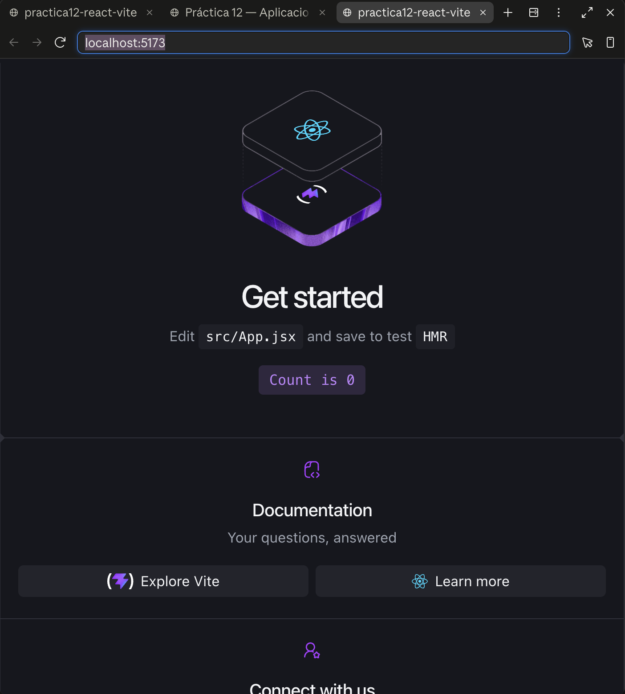
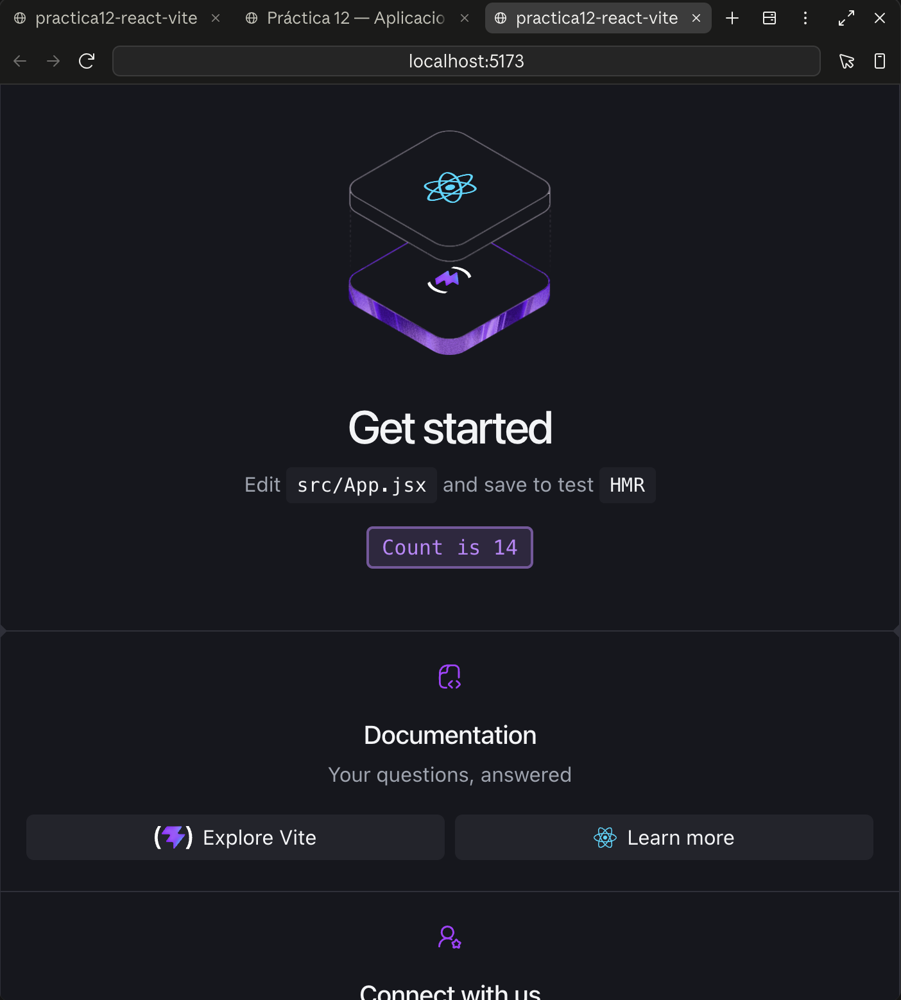

# Práctica 12 — Primera app de React (`practica12-react-vite`)

## Objetivo

Crear el primer proyecto de React usando **Vite** como generador y servidor de desarrollo, entender su estructura base y el hook `useState`.

Este proyecto se dejó **tal cual lo genera el comando oficial**, sin modificar `App.jsx`:

```bash
npm create vite@latest practica12-react-vite -- --template react
```

## Tecnologías

- React 19
- Vite

## Instalación y ejecución

```bash
npm install
npm run dev
```

Vite levanta el servidor de desarrollo (por defecto en `http://localhost:5173`).

## Estructura del proyecto

- **`index.html`**: el único HTML real de la app. Tiene un `<div id="root"></div>` vacío y carga `src/main.jsx` como módulo.
- **`src/main.jsx`**: el punto de entrada de JavaScript. Toma ese `<div id="root">` con `document.getElementById('root')` y le pide a React que renderice el componente `<App />` dentro de él, usando `createRoot(...).render(...)`.
- **`src/App.jsx`**: el componente principal — una función que devuelve JSX (HTML mezclado con JavaScript) describiendo lo que se ve en pantalla. Es el que trae la plantilla por defecto: el logo de React, el logo de Vite, la sección "Get started" con el contador, y los links de documentación/comunidad.
- **`vite.config.js`**: configuración del servidor de desarrollo y del build (plugins, etc.).

## El hook `useState`

```jsx
const [count, setCount] = useState(0)
```

`useState(0)` crea una **variable de estado** que empieza en `0` y una función (`setCount`) para actualizarla. A diferencia de una variable normal de JavaScript, cuando se llama `setCount(...)`, React vuelve a ejecutar el componente y actualiza solo la parte del DOM que cambió — sin recargar la página ni manipular el HTML a mano.

El botón de la plantilla usa:

```jsx
<button
  type="button"
  className="counter"
  onClick={() => setCount((count) => count + 1)}
>
  Count is {count}
</button>
```

Cada clic llama `setCount((count) => count + 1)`, que le dice a React "toma el valor actual y súmale 1". React reprograma el render y el texto del botón se actualiza solo.

## Pruebas realizadas

Servidor levantado con `npm run dev` y probado en el navegador integrado, con captura antes y después de hacer clic en el botón.

**Antes de hacer clic (`Count is 0`):**



**Después de hacer clic (`Count is 14`):**


